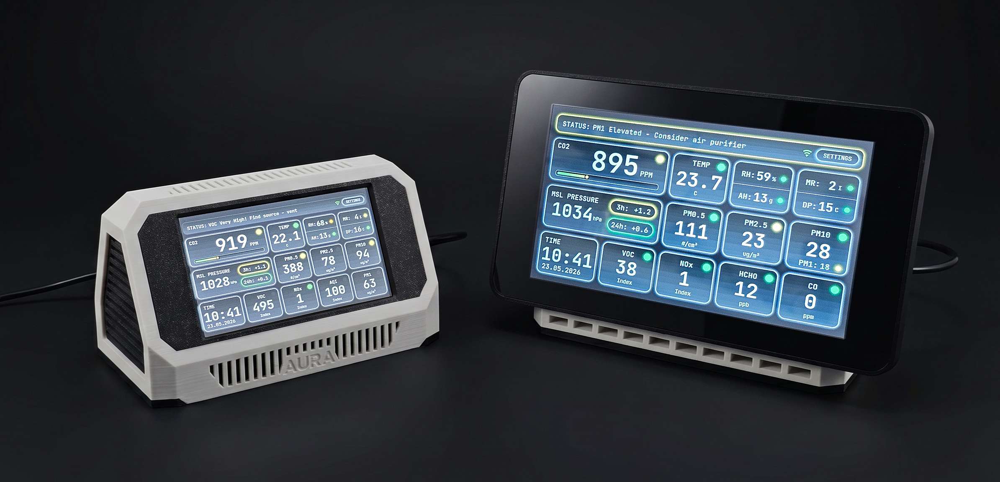
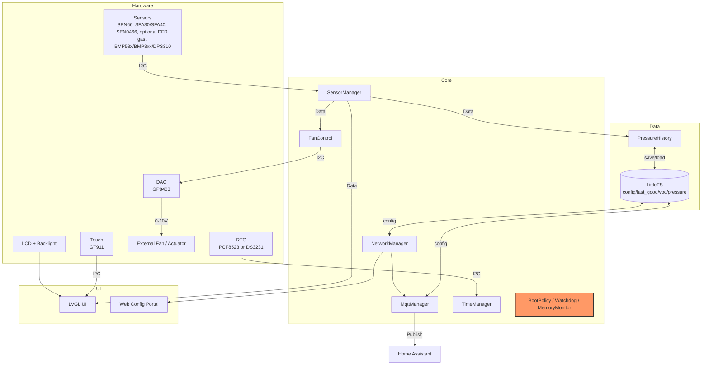

# Project Aura AQ

[](https://platformio.org/)
[](https://www.espressif.com/en/products/socs/esp32-s3)
[](https://lvgl.io/)
[](LICENSE)
[](https://www.youtube.com/watch?v=TNsyDGNrN-w)
[](https://www.youtube.com/watch?v=1pzBqcmbWl8)
[](https://www.youtube.com/watch?v=mSIv5ukjMyY)

Project Aura AQ is an open-source ESP32-S3 air-quality station built for makers who want a
polished, finished device rather than a temporary sensor prototype. You print the enclosure, install
top-tier sensors, flash the firmware from a browser, and get a touchscreen air-quality monitor with a
local web dashboard, OTA updates, MQTT/Home Assistant integration, optional 0-10V ventilation
control, and no cloud dependency.

This repository contains the firmware source code and configuration needed to flash and customize the device.

> **Support the project:** back the MakerWorld project to get the detailed build guide, 3D-printable
> enclosure models, Bambu-ready 3MF files, and wiring instructions:
> https://makerworld.com/en/crowdfunding/159-project-aura-aq-make-the-invisible-visible

**Join the community:** [GitHub Discussions](https://github.com/21cncstudio/project_aura/discussions)

## TL;DR
- **What it is:** a finished DIY air-quality monitor with touchscreen UI, local dashboard, OTA updates, and Home Assistant support.
- **Display options:** Waveshare ESP32-S3-Touch-LCD-4.3 and ESP32-S3-Touch-LCD-7.0 are supported. The 16 MB flash version is mandatory.
- **Minimum useful BOM:** compatible Waveshare display board + Sensirion SEN66 + stable 5V/2A USB power. Everything else is optional.
- **Build paths:** use the recommended custom Aura PCB for the cleanest build, or the classic module-based Adafruit/STEMMA QT/Qwiic path.
- **First flash:** easiest through the browser-based web installer; developers can build from source with PlatformIO.
- **Works without internet:** AP setup mode and the local dashboard are fully offline.

## Table of Contents
- [Videos](#videos)
- [Highlights](#highlights)
- [Gallery](#gallery)
- [UI Screens](#ui-screens)
- [Web Dashboard](#web-dashboard)
- [Project Files and Backer Resources](#project-files-and-backer-resources)
- [Hardware and BOM](#hardware-and-bom)
- [Optional Sensor Expansion](#optional-sensor-expansion)
- [Build Options](#build-options)
- [Assembly and Wiring Notice](#assembly-and-wiring-notice)
- [Pin Configuration](#pin-configuration)
- [UI Languages](#ui-languages)
- [Firmware Architecture](#firmware-architecture)
- [Build and Flash](#build-and-flash-platformio)
- [Configuration](#configuration)
- [MQTT + Home Assistant](#mqtt--home-assistant)
- [Network Requirements](#network-requirements)
- [An Honest Note About Cost](#an-honest-note-about-cost)
- [Contributing](#contributing)
- [License and Commercial Use](#license-and-commercial-use)
- [Tests](#tests)
- [Repo Layout](#repo-layout)
- [AI Assistance](#ai-assistance)

## Videos
Watch the demo:
[](https://www.youtube.com/watch?v=TNsyDGNrN-w)

Also watch the hands-on review:
[Project Aura review on YouTube](https://www.youtube.com/watch?v=1pzBqcmbWl8)

Full assembly guide:
[](https://www.youtube.com/watch?v=mSIv5ukjMyY)

The assembly video walks through both supported build styles: the original 4.3" Aura AQ with classic
Adafruit/STEMMA QT modules, and the 7" Aura XL build with the custom Aura Sensor Hub PCB. It covers
I2C cable pin swaps, custom sensor cables, module and PCB connections, enclosure mounting, first boot
testing, and the 180-degree screen rotation setting for the 7" build.

## Highlights

**Telemetry**
- Particulate: PM0.5 / PM1 / PM2.5 / PM4 / PM10
- Gases: CO, CO2, VOC, NOx, HCHO, plus one optional electrochemical gas (NH3, SO2, NO2, H2S, or O3)
- Climate: temperature, humidity, absolute humidity (AH), pressure

**UI and integration**
- Smooth LVGL UI with night mode, custom themes, and status indicators
- Integrated web dashboard at `/dashboard`: live state, charts, events, settings sync, DAC page, OTA firmware update
- Easy setup: Wi-Fi AP onboarding + mDNS access (`http://<hostname>.local`)
- Home Assistant ready: automatic MQTT discovery and ready-to-use dashboard YAML

**Hardware**
- 4.3" and 7" Waveshare ESP32-S3 touchscreen builds are supported
- Recommended custom Aura PCB path plus classic module-based path
- No soldering required for the recommended PCB build
- Optional DAC control (GP8403, 0-10V): manual levels/timer plus automatic demand mode from air-quality thresholds
- Hardware autodetect: PCF8523/DS3231 RTC plus BMP58x/BMP3xx/DPS310 pressure
- Robust Safe Boot: automatic rollback to the last-known-good config after crashes


## Gallery



## UI Screens
<table>
  <tr>
    <td align="center"><br/>Dashboard</td>
    <td align="center"><br/>Settings</td>
    <td align="center"><br/>Theme Presets</td>
  </tr>
  <tr>
    <td align="center"><br/>MQTT</td>
    <td align="center"><br/>Date &amp; Time</td>
    <td align="center"><br/>Backlight</td>
  </tr>
</table>

## Web Dashboard
Project Aura serves two web experiences from the device:

- Setup portal (AP mode): opening `/` in AP mode shows the captive Wi-Fi setup flow (`/wifi`).
- Full dashboard (`/dashboard`): tabs for Sensors, Charts, Events, Settings, and System.
- Dedicated DAC page (`/dac`): live status, manual controls, auto mode, and auto-threshold config.
- OTA from dashboard: upload firmware `.bin` directly via the web UI.
- Dashboard assets are served locally in both AP and STA modes (no CDN dependency).

Useful API routes used by the dashboard:
- `GET /api/state`
- `GET /api/charts?group=core|gases|pm&window=1h|3h|24h`
- `GET /api/events`
- `GET /api/diag` (AP setup mode only)
- `POST /api/settings`
- `POST /api/ota`

## Project Files and Backer Resources
This GitHub repository contains the open-source firmware, web dashboard assets, Home Assistant examples,
test suite, and developer build configuration.

MakerWorld backers receive the digital build ecosystem that is not stored in this repository:
- 3D-printable enclosure files
- Bambu-ready 3MF build plates and STL files
- Detailed build guide and wiring instructions
- Firmware release files and browser web installer access
- Ongoing project updates and backer resources

Electronic components are purchased separately. You can build Aura using the recommended custom Aura
PCB path or the classic module-based path; you do not need both.

## Hardware and BOM
Project Aura is designed around high-quality components to ensure accuracy and long-term usefulness.
If you are sourcing parts yourself, start with the display board and the SEN66. Add optional sensors
only when they make sense for your room, workshop, printer setup, or automation goals.

| Component | Part / Model |
| :--- | :--- |
| Core Board, 4.3" | [Waveshare ESP32-S3-Touch-LCD-4.3 (800x480)](https://www.waveshare.com/esp32-s3-touch-lcd-4.3.htm?&aff_id=144793) |
| Core Board, 7" | [Waveshare ESP32-S3-Touch-LCD-7.0](https://www.waveshare.com/esp32-s3-touch-lcd-7.htm?&aff_id=144793) |
| Main Sensor | [Sensirion SEN66](https://sensirion.com/products/catalog/SEN66) via custom Aura PCB or Adafruit SEN6x breakout |
| Recommended Sensor Hub | [Project Aura AQ Sensor Hub PCB v1.1](https://www.pcbway.com/project/shareproject/Project_Aura_AQ_Sensor_Hub_PCB_v1_1_e4aa6e80.html) with built-in BMP388 pressure sensor, RTC module, capacitor, and the required sensor connectors (optional but recommended) |
| Carbon Monoxide (CO) | [DFRobot SEN0466 — Factory Calibrated Electrochemical CO (0-1000 ppm, I2C & UART)](https://www.dfrobot.com/product-2508.html?tracking=aJ5V32) (optional) |
| Formaldehyde (HCHO) | Sensirion SFA30 (0-1000 ppb) **or** SFA40 — both autodetected. SFA40 available as the [DFRobot SEN0661 breakout](https://www.dfrobot.com/product-3020.html?tracking=aJ5V32) (optional) |
| Optional DFR Gas Slot | One DFRobot electrochemical sensor at a time: [SEN0469 NH3](https://www.dfrobot.com/product-2513.html?tracking=aJ5V32), [SEN0470 SO2](https://www.dfrobot.com/product-2514.html?tracking=aJ5V32), [SEN0471 NO2](https://www.dfrobot.com/product-2515.html?tracking=aJ5V32), [SEN0467 H2S](https://www.dfrobot.com/product-2511.html?tracking=aJ5V32), or [SEN0472 O3](https://www.dfrobot.com/product-2516.html?tracking=aJ5V32). Set the module's I2C address to `0x75` per the [DFRobot wiki](https://wiki.dfrobot.com/sen0465/docs/21907) (optional) |
| Pressure | Adafruit BMP580 or DPS310. Firmware autodetects BMP580/581, BMP585, BMP388, BMP390, and DPS310 (recommended) |
| RTC | Adafruit PCF8523. Firmware autodetects PCF8523 and DS3231; a manual RTC override is also available (recommended) |
| DAC Output | [DFRobot GP8403 2-Channel I2C DAC (0-10V), DFR0971](https://www.dfrobot.com/product-2613.html?tracking=aJ5V32) — VOUT0 used (optional) |

**Notes**
- Use only Waveshare boards with 16 MB flash. 8 MB flash variants will not work with Project Aura firmware and filesystem.
- SEN66 VOC/NOx require about 5 minutes of warmup for reliable readings; the UI shows WARMUP during this period.
- If the CO sensor (SEN0466) is not detected at boot, CO is marked unavailable and the rest of the telemetry stays active.
- Aura auto-detects which DFR gas variant is installed on the optional slot and exposes the matching local UI and MQTT/Home Assistant entities.
- Affiliate disclosure: the Waveshare and DFRobot links above are affiliate links and help support Project Aura at no extra cost.

Recommended retailers: Mouser, DigiKey, LCSC, Adafruit, Seeed Studio, DFRobot, and Waveshare.

## Optional Sensor Expansion
Most consumer air-quality monitors stop at PM, CO2, VOC, temperature, and humidity. Aura can go
further because the firmware, UI, dashboard, MQTT discovery, and optional hardware are designed as
one expandable platform.

Optional sensors let one build focus on the environment it is actually monitoring:
- HCHO sensing helps track formaldehyde and material off-gassing from furniture, plywood, paints,
  adhesives, resins, laser-cut materials, and new interiors.
- CO sensing is useful around combustion appliances, garages, workshops, and ventilation experiments.
  It is telemetry, not a certified CO alarm.
- The optional DFR electrochemical gas slot can target NH3, SO2, NO2, H2S, or O3. That makes Aura
  interesting for farms and animal rooms, small production spaces, labs, classrooms, print rooms,
  laser rooms, storage areas, and custom ventilation projects.
- Pressure, RTC, DAC output, MQTT, and Home Assistant support make the readings actionable: log
  trends, trigger automations, control ventilation, or compare before/after filtration changes.

Install only the sensors that match your real use case. Aura is not a certified safety or regulatory
instrument; for life-safety or compliance work, use certified detectors and calibrated instruments.
The goal is to make one open, repairable platform adaptable to places where ordinary consumer
monitors cannot see enough.

## Build Options
Choose one electronics path. You do not need both.

**Recommended path: custom Aura PCB**
- Replaces several separate modules, hubs, short cables, and capacitor wiring with one dedicated board.
- Includes a BMP388 pressure sensor, RTC module, SEN66 connection path, capacitor, and all required connectors for the supported optional sensors.
- Lets most optional sensors connect using the cables supplied with those sensor modules.
- Best choice for new builders when the PCB is available in your region.

PCB and reseller links:
- PCBWay shared project: https://www.pcbway.com/project/shareproject/Project_Aura_AQ_Sensor_Hub_PCB_v1_1_e4aa6e80.html
- Smartdomo, Germany: https://smartdomo.de/
- Cuzom, Finland: https://cuzom.com/shop/aura-pcb
- SVR3DPrints, Netherlands: https://svr3dprints.nl/aura-aq
- Savi Dynamics, USA: https://shop.savidynamics.com/shop
- Manger Made LLC, USA: https://mangermadellc.com/product/project-aura-pcb/
- Myndworx Asylum, Australia: https://www.myndworx.com/

**Classic path: Adafruit / STEMMA QT / Qwiic modules**
- Still fully supported by firmware and documentation.
- Best if you already bought the original BOM components.
- Requires more cables and more attention to connector pin order.
- Do not skip the electrolytic capacitor listed in the classic BOM.
- Useful when you want maximum sourcing flexibility for pressure, RTC, and hub modules.

## Assembly and Wiring Notice
Please pay close attention to cabling and power before turning the device on.

For the recommended Aura PCB path, the build is designed to be a clean plug-together process using
the documented connectors. For the classic module-based path, some off-the-shelf cables may need
pin-order changes and the wiring requires more attention.

Backers: please refer to the comprehensive Build Guide included in your reward for the exact wiring diagram
and a trouble-free assembly.

DIY: verify pinouts against the pin table below before powering on to avoid damaging components. Use
a stable 5V/2A USB power supply and a short, good-quality USB cable.

## Pin Configuration
| Component | Pin (ESP32-S3) | Notes |
| :--- | :--- | :--- |
| 3V3 | 3V3 | Power for external I2C sensors |
| GND | GND | Common ground |
| I2C SDA | GPIO 8 | Shared bus for all sensors and the DAC (see BOM) |
| I2C SCL | GPIO 9 | Shared bus |

Display and touch are integrated on the board; no external wiring is needed for them.
For DAC control, analog output is generated on the GP8403 module (`VOUT0`), not on a direct ESP32 pin.

## UI Languages
Project Aura speaks your language. You can switch languages in the Settings menu:
- English
- Deutsch
- Espanol
- Francais
- Italiano
- Portugues BR
- Nederlands
- Simplified Chinese

## Firmware Architecture
Data flow and responsibilities are intentionally split into small managers:



Core modules live in `src/core/` and orchestrate startup (`AppInit`, `BoardInit`).
Feature managers are in `src/modules/`, UI in `src/ui/`, and web pages in `src/web/`.

## Build and Flash (PlatformIO)
For most builders, the first flash is easiest through the browser-based Aura Web Installer:

https://aura.21cncstudio.com/

Connect the Waveshare board through its data USB-C port, open the installer in a compatible browser,
and follow the build guide. After first flash and Wi-Fi setup, normal firmware updates can be done
from Aura's local dashboard using OTA `.bin` files from GitHub releases.

For development builds, use PlatformIO CLI or VSCode + PlatformIO extension.
The firmware is built with Arduino ESP32 core 3.1.1 (ESP-IDF 5.3.x).

```powershell
git clone https://github.com/21cncstudio/project_aura.git
cd project_aura
pio run -e project_aura                  # build firmware
pio run -e project_aura -t upload        # flash firmware
pio run -e project_aura -t uploadfs      # flash LittleFS image (web/UI assets)
pio device monitor -b 115200             # serial monitor
```

> **Note:** `uploadfs` is required at least once on a fresh device. Without it the web dashboard and translations will be missing. Re-run it whenever assets in `data/` change.

## Configuration
1. Wi-Fi setup:
   On first boot, the device creates a hotspot: `Aura-XXXXXX-AP` (fallback: `ProjectAura-Setup`).
   Connect to it and open http://192.168.4.1 to configure Wi-Fi credentials.
2. Web portal:
   After saving Wi-Fi, wait about 15 seconds for AP -> STA transition.
   Then access the device at `http://<hostname>.local/` (default hostname format: `aura-XXXXXX`, for example `aura-1a2b3c.local`) or by IP.
   Do not keep using `http://192.168.4.1` after STA connection; that address is AP-setup only.
   In STA mode, `/` opens the dashboard. In AP mode, `/` opens setup and `/dashboard` opens the offline dashboard.
3. Home Assistant:
   MQTT discovery is enabled by default. The device appears in HA via MQTT integration automatically.
   A ready-to-use dashboard YAML is available at `docs/home_assistant/dashboard.yaml`.
   Setup guide: `docs/home_assistant/README.md`.

Optional compile-time defaults belong in `include/secrets.h`, which is ignored by git.
Copy and edit (Windows / Unix):

```text
copy include\secrets.h.example include\secrets.h    # Windows
cp    include/secrets.h.example include/secrets.h    # macOS / Linux
```

## MQTT + Home Assistant
- State topic: `<base>/state`
- Availability topic: `<base>/status`
- Commands: `<base>/command/*` (night_mode, alert_blink, backlight, restart)
- Home Assistant discovery: `homeassistant/*/config`
- Discovery payload includes dedicated sensors for `CO` (`co`), `PM0.5` (`pm05`), and the optional DFR gas slot (`nh3`, `so2`, `no2`, `h2s`, `o3`, plus generic optional gas state/type sensors as applicable).

MQTT stays idle until configured and enabled.


## Network Requirements
- AP setup mode (`http://192.168.4.1`) is local-only and works without internet.
- STA mode dashboard (`http://<hostname>.local/dashboard` or `http://<ip>/dashboard`) requires the client and Aura to be in the same L2/L3 network path.
- If mDNS (`.local`) is blocked on your network, use the direct IP from the device screen or router DHCP table.
- Avoid guest networks, client isolation, or VLAN rules that block peer-to-peer LAN traffic.
- Required local traffic:
  - HTTP: TCP `80` to Aura
  - mDNS: UDP `5353` multicast (only for `.local` hostname discovery)
- During OTA, keep one active client tab/session to reduce transfer failures.

Quick diagnostics for support:
- `GET /api/state` should return live JSON with `network.mode`, `network.ip`, and sensor payload.
- `GET /api/diag` (available in AP setup mode) shows Wi-Fi state, IP/hostname, heap, OTA busy state, and recent warnings/errors.

## An Honest Note About Cost
The electronic component cost is not money received by the project. It is the approximate market
price of the hardware you buy separately: touchscreen board, SEN66 sensor, PCB or modules, cables,
fasteners, power parts, and any optional sensors you choose to add. The final price depends on your
country, shipping, taxes, availability, and selected options.

What MakerWorld backers support is the work behind the device: enclosure design, firmware
architecture, touchscreen UI, web installer, local dashboard, OTA update flow, Home Assistant
integration, testing, documentation, updates, and support.

Cheap closed monitors can be useful, but Project Aura AQ is a different kind of device. It is for
people who want control, transparency, repairability, local integration, open-source firmware, and
the experience of building a real device themselves.

## Contributing
Contributions are welcome! Please read [`CONTRIBUTING.md`](CONTRIBUTING.md) for details on the process for submitting pull requests and the Contributor License Agreement (CLA).

Found a bug? Open an Issue: https://github.com/21cncstudio/project_aura/issues
Have a question? Ask in Discussions: https://github.com/21cncstudio/project_aura/discussions

## License and Commercial Use
- Firmware in this repository is licensed under GPL-3.0-or-later (see `LICENSE`).
- Commercial use is allowed under GPL. If you distribute firmware (including in devices), you must provide the Corresponding Source under GPL.
- If you need to sell devices while keeping firmware modifications proprietary, obtain a Commercial License (see `COMMERCIAL_LICENSE_SUMMARY.md`).
- Enclosure models and the PDF build guide are not in this repository; they are available to backers on MakerWorld under separate terms.
- Trademark and branding use is covered by `TRADEMARKS.md`.

## Tests
See `TESTING.md` for native host tests and `scripts/run_tests.ps1`.

## Repo Layout
- `src/core/` boot, init, reliability
- `src/modules/` sensors, storage, network, MQTT, time
- `src/ui/` LVGL screens, assets, controllers
- `src/web/` HTML templates and handlers
- `test/` native tests and mocks

## AI Assistance
Parts of this project are developed with AI-assisted workflows.
Primary coding assistance is provided by GPT-5 Codex in a local developer workspace.
